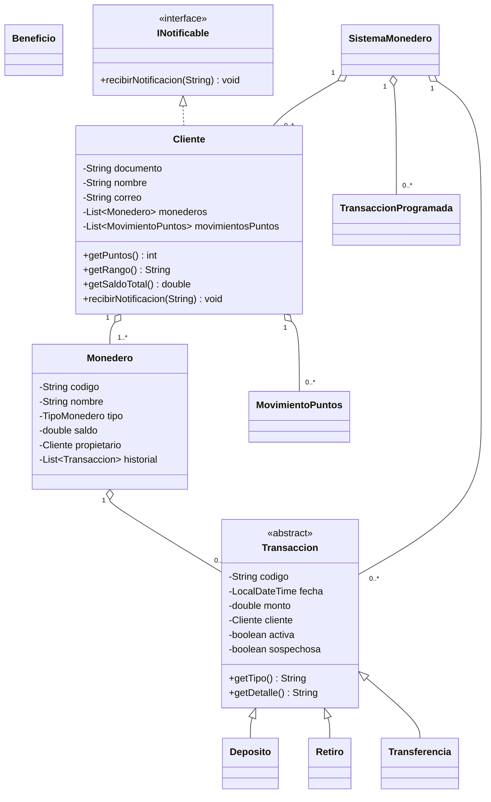

# Diagrama de clases — Monedero Plus

```mermaid
classDiagram
    class Cliente {
      -String documento
      -String nombre
      -String correo
      -List~Monedero~ monederos
      -List~MovimientoPuntos~ movimientosPuntos
      +getPuntos() int
      +getRango() String
      +getSaldoTotal() double
      +recibirNotificacion(String) void
    }
    class Monedero {
      -String codigo
      -String nombre
      -TipoMonedero tipo
      -double saldo
      -Cliente propietario
      -List~Transaccion~ historial
    }
    class Transaccion {
      <<abstract>>
      -String codigo
      -LocalDateTime fecha
      -double monto
      -Cliente cliente
      -boolean activa
      -boolean sospechosa
      +getTipo() String
      +getDetalle() String
    }
    class Deposito
    class Retiro
    class Transferencia
    class MovimientoPuntos
    class Beneficio
    class TransaccionProgramada
    class SistemaMonedero
    class INotificable {
      <<interface>>
      +recibirNotificacion(String) void
    }
    Transaccion <|-- Deposito
    Transaccion <|-- Retiro
    Transaccion <|-- Transferencia
    INotificable <|.. Cliente
    Cliente "1" o-- "1..*" Monedero
    Cliente "1" o-- "0..*" MovimientoPuntos
    Monedero "1" o-- "0..*" Transaccion
    SistemaMonedero "1" o-- "0..*" Cliente
    SistemaMonedero "1" o-- "0..*" Transaccion
    SistemaMonedero "1" o-- "0..*" TransaccionProgramada
```
